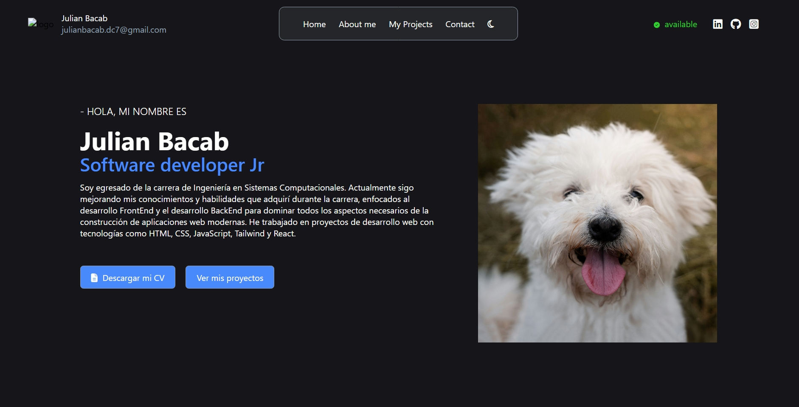

# 🧑🏽‍💻 Mi portafolio web

_El objetivo de este proyecto es implementar todas las tecnologías fundamentales del desarrollo web en uno solo. Es una forma de poner aprueba mis conocimientos para poder escalar a nuevas tecnologías utilizando buenas prácticas._

_Crear un portafolio web permite que muchas personas como reclutadores y otros desarrolladores conozcan a profundidad lo que uno hace como desarrollador. Quiero llevar el control de cada actualización y mejora del diseño de mi portafolio que tendrá como resultado un diseño profesional, claro y bien estructurado._

---

## 🚀 Tecnologías utilizadas

- **HTML5**
- **CSS3**
- **Javascript (Vanilla)**
- **Git & GitHub para el control de versiones**

---

## 🖼️ Vista previa

---

#### <h4 align="center">

🚧 Proyecto en construcción 🚧

</h4>
